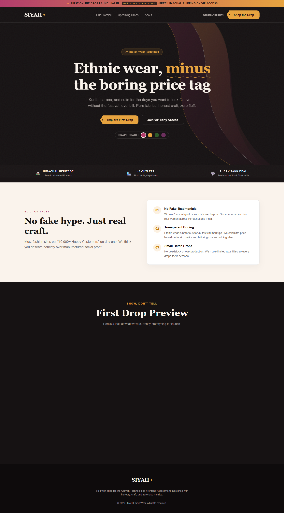

# 🏔️ SIYAH — Premium Indian Ethnic Wear Landing Page

> **Acdyon Technologies Take-Home Assessment (Track 2: Premium Home Page)**  
> *Grown in the mountains of Himachal Pradesh. From 10 offline retail stores to a national Shark Tank India deal — bringing pure handloom fabrics, honest pricing, and zero fluff directly to you.*

[](https://priya-raj8.github.io/Siyah-the-new-era-of-Clothing/)
[](https://github.com/Priya-Raj8/Siyah-the-new-era-of-Clothing)
[](https://github.com/Priya-Raj8/Siyah-the-new-era-of-Clothing)

---

## 🌟 Visual Preview



---

## 🌐 Live GitHub Pages Link

👉 **[https://priya-raj8.github.io/Siyah-the-new-era-of-Clothing/](https://priya-raj8.github.io/Siyah-the-new-era-of-Clothing/)**

---

## 📖 Brand Story & Context

**SIYAH** is an authentic Indian ethnic wear brand (handloom sarees, workday kurtis, 3-piece festive suit sets):
- 🏔️ **Himachal Roots**: Born and crafted in the mountains of Himachal Pradesh.
- 🏬 **Physical Retail Outlets**: Started with 10 offline retail flagship stores across Himachal.
- 🦈 **Shark Tank India Featured**: Featured on Shark Tank India and successfully secured a national investment deal.
- 💡 **Core Value Proposition**: *"Ethnic wear, minus the boring price tag."*

---

## ✨ Key Features & UX Innovations

### 1. 🎨 Live Drape Shade Studio (Hero Customizer)
Visitors can click real-time color swatches (*Rani Pink*, *Marigold Gold*, *Forest Green*, *Plum Silk*) in the hero section to live-morph the background fluttering SVG saree pallu gradients in 60 FPS.

### 2. 🔍 Honest Price Math Breakdown Modal
Clicking **`View Price Math`** on any product card triggers an interactive cost modal demonstrating exact pricing transparency:
- Pure Fabric Sourcing: `₹1,100`
- Master Artisan Tailoring: `₹750`
- Packaging & Eco Shipping: `₹249`
- Traditional Retailer 4x Markup: `+ ₹4,500 ❌`
- **SIYAH Fair Price**: **`₹2,099 ✅`**

### 3. ✨ Gold Zari Sparkle Cursor Particle Trail
An HTML5 Canvas particle engine (`#sparkleCanvas`) generates a subtle, hardware-accelerated trail of shimmering gold and rani pink zari sparkles following cursor movement in the hero section.

### 4. ⚡ Real-Time Launch Countdown Ticker
A top notification banner featuring an active live countdown timer (`03d : 14h : 22m : 45s`) creating immediate brand hype upon entry.

### 5. 👑 VIP Early Access & Account Modal
A functional modal form with validation, smooth submission state handling, and 10% promo code reward (`SIYAHVIP10`).

### 6. 🏆 Honesty-First Section
Strictly **zero fake metrics** ("10,000+ happy buyers"), zero fake countdown timers, and zero fabricated testimonials.

---

## 📂 Repository Structure

```
├── index.html           # Full self-contained landing page (HTML5, CSS3, Vanilla JS)
├── DECISIONS.md        # 1-Page Engineering & Design Rationale write-up
├── README.md           # Project documentation & overview
├── desktop_preview.png  # High-resolution desktop screenshot preview
└── mobile_preview.png   # Mobile responsiveness preview
```

---

## 🛠️ Tech Stack & Implementation Rules

- **Pure HTML5 / CSS3 / Vanilla JavaScript**: Zero external npm dependencies or heavy frameworks to guarantee sub-second initial load times.
- **Typography**: `Fraunces` (Serif Display) + `Work Sans` (Sans-Serif Body) via Google Fonts.
- **Zero Heavy Assets**: All textures and ribbons powered by inline SVG and CSS gradients.

---

## 🚀 How to Run Locally

1. Clone or download this repository:
   ```bash
   git clone https://github.com/Priya-Raj8/Siyah-the-new-era-of-Clothing.git
   ```
2. Open `index.html` directly in any web browser, or run a local static server:
   ```bash
   npx http-server -p 8000
   ```
3. Open `http://localhost:8000`.

---

## 📝 Design Decisions

For a line-by-line defense of architectural trade-offs, performance decisions, and AI assistance transparency, please refer to [`DECISIONS.md`](DECISIONS.md).
